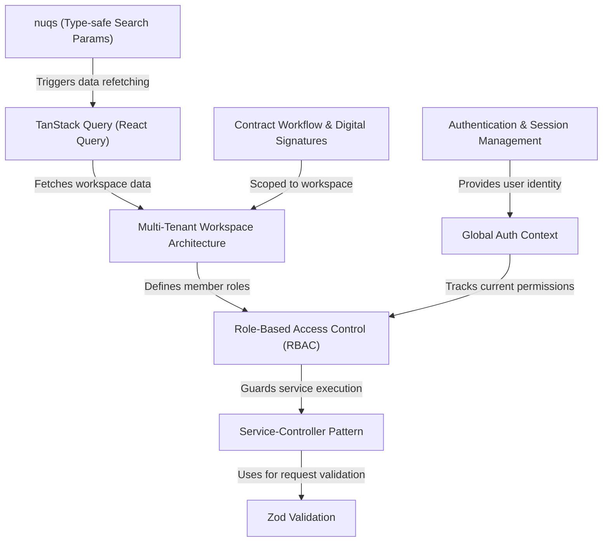
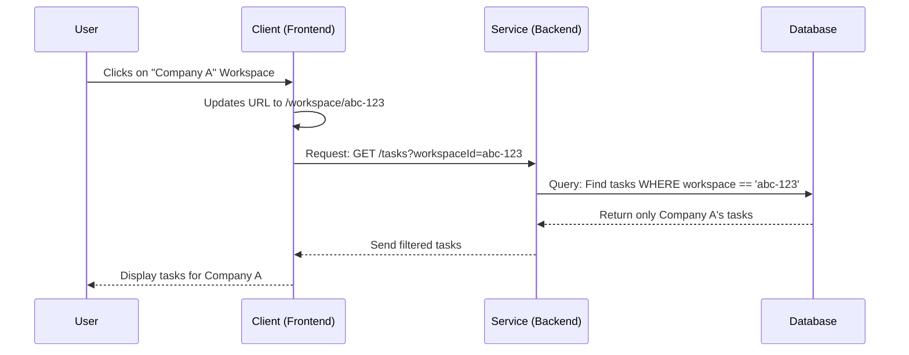
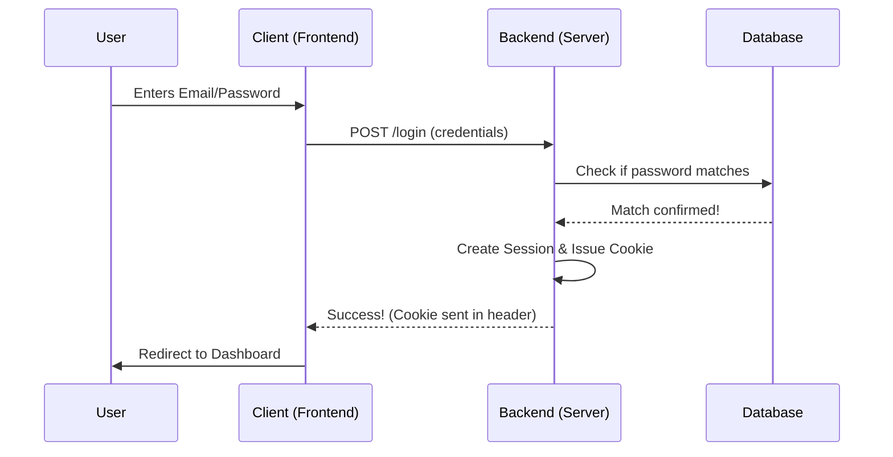
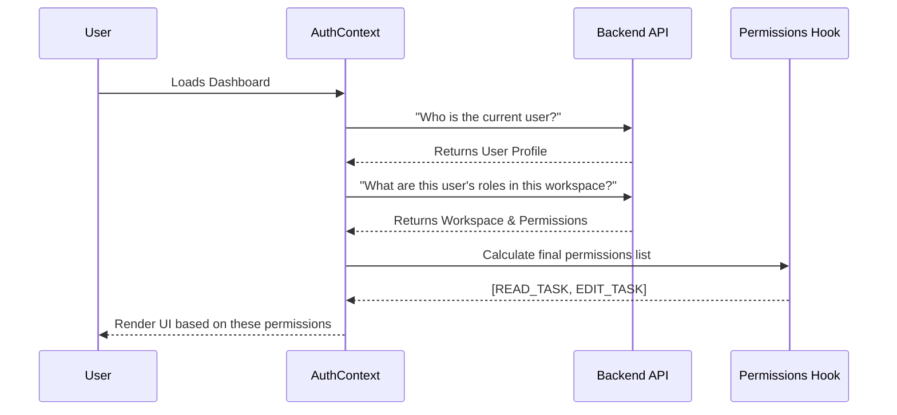
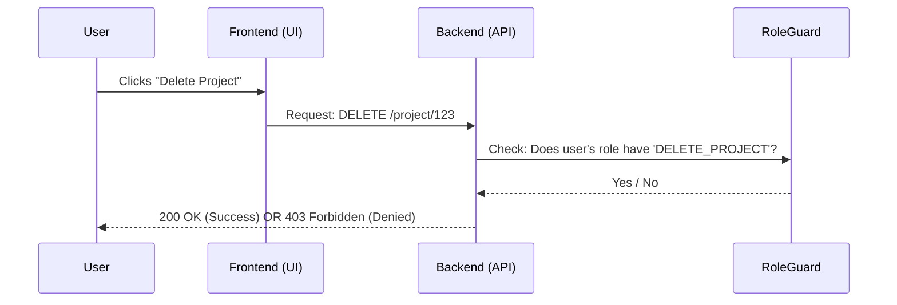
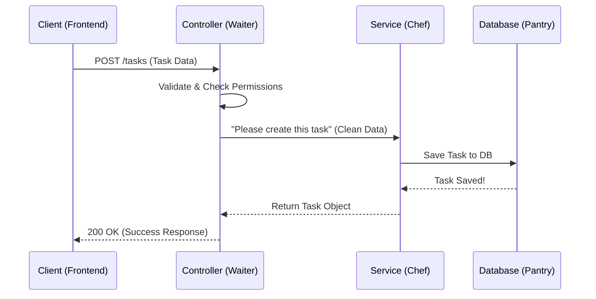
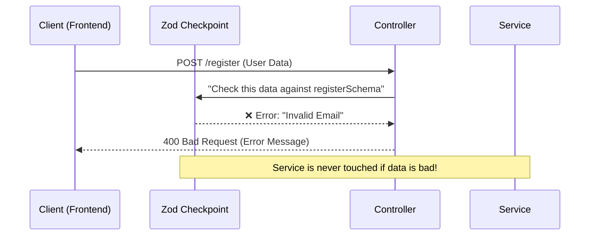
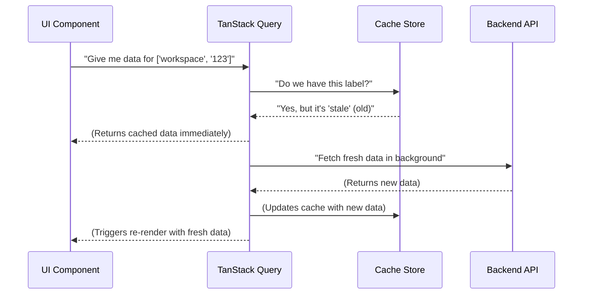
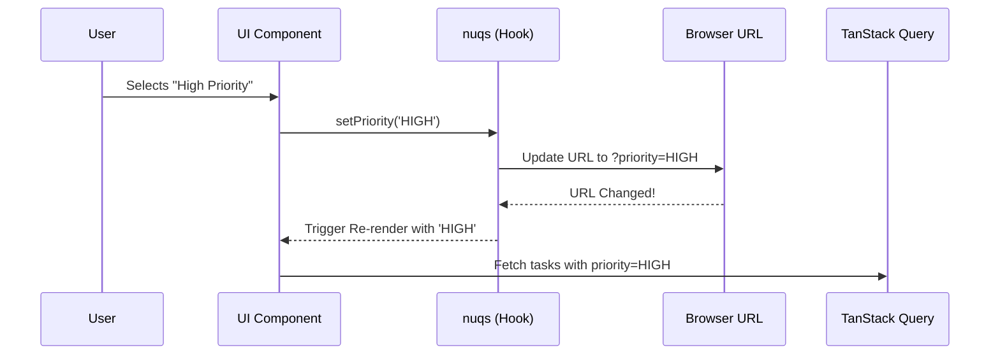
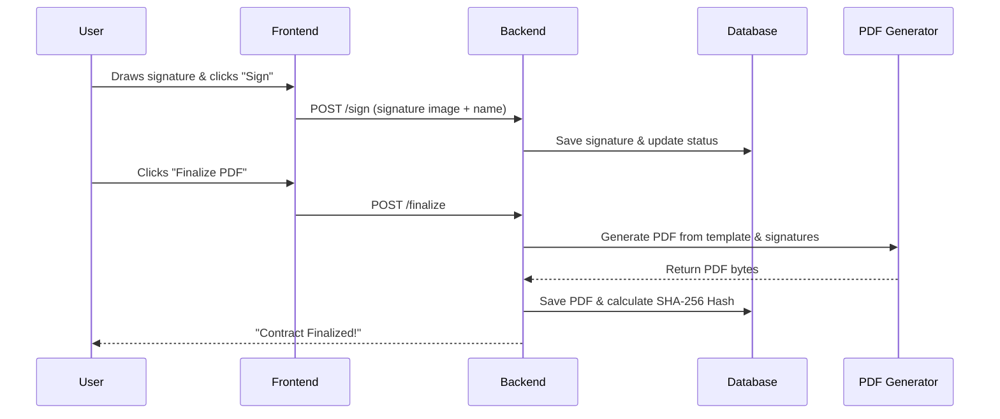

# Tutorial: TaskFlow

## Why I Built This Project

If you have ever worked on a team—or even just tried to organize your own life—you know the struggle. 

At first, you start with a simple notepad. Then you upgrade to sticky notes. Eventually, your monitor is surrounded by a neon forest of paper, and you are terrified to sneeze because it might erase your entire Q3 roadmap.

So, you decide to go digital. You try Jira (too complex, you need a PhD to close a ticket). You try Trello (too simple, everything becomes a giant list). You try Asana, Monday, Notion... and suddenly you realize you are spending more time *managing* your tasks than actually *doing* them.

One Tuesday at 2 AM, after spending 45 minutes trying to configure permissions on a premium task-tracker just to assign a bug to my coworker, a familiar thought crept into my brain:

**I am a software engineer. Why am I fighting with these tools when I can just build my own?** 

(Yes, this is the classic developer trap. And yes, I fell right into it.)

That is how **TaskFlow** was born.

Instead of fighting with bloated enterprise software or paying $15/user/month for features I don’t need, I built a web app where I can:
- Create workspaces without needing a manual.
- Actually manage roles and permissions without tearing my hair out.
- Keep track of contracts, invoices, and analytics in one clean, multi-tenant environment.
- And most importantly, manage tasks efficiently without feeling like the software is judging me.

TaskFlow is my personal rebellion against overly complicated project management tools. 

And honestly? It feels incredibly satisfying to move a ticket to "Done" on a platform you built yourself.

---
# Tutorial: TaskFlow

**TaskFlow** is a *multi-tenant productivity platform* designed to help teams organize projects and tasks within private, isolated **Workspaces**. It features a robust security system using **Role-Based Access Control (RBAC)** and a specialized **Contract Workflow** for handling digital signatures and PDF generation. The application ensures a seamless user experience by combining *type-safe validation* with *efficient data synchronization* between the frontend and backend.


**Source Repository:** [https://github.com/Yashraj-sherke/TaskFlow](https://github.com/Yashraj-sherke/TaskFlow)



## Chapters

1. [Multi-Tenant Workspace Architecture
](01_multi_tenant_workspace_architecture_.md)
2. [Authentication & Session Management
](02_authentication___session_management_.md)
3. [Global Auth Context
](03_global_auth_context_.md)
4. [Role-Based Access Control (RBAC)
](04_role_based_access_control__rbac__.md)
5. [Service-Controller Pattern
](05_service_controller_pattern_.md)
6. [Zod Validation
](06_zod_validation_.md)
7. [TanStack Query (React Query)
](07_tanstack_query__react_query__.md)
8. [nuqs (Type-safe Search Params)
](08_nuqs__type_safe_search_params__.md)
9. [Contract Workflow & Digital Signatures
](09_contract_workflow___digital_signatures_.md)


---

Generated by [AI Codebase Knowledge Builder](https://github.com/The-Pocket/Tutorial-Codebase-Knowledge)


---


# Chapter 1: Multi-Tenant Workspace Architecture

Welcome to the first chapter of the TaskFlow tutorial! Before we dive into the code, let's understand the "Big Idea" that powers the entire organization of this application.

## The Problem: The "Global Mess"
Imagine you are building a task manager. If you just create a list of tasks in a database, every user sees every task. That’s a disaster! 

Now, imagine you want to allow a user to have a "Work" list and a "Personal" list. Or, imagine you are selling this software to two different companies: **Company A** and **Company B**. Company A should never see Company B's projects, tasks, or member lists.

How do we keep these worlds separate while using the same application? The answer is **Multi-Tenant Workspace Architecture**.

## The Concept: The Digital Office Building
Think of TaskFlow as a giant **Digital Office Building**. 

- **The Building:** The TaskFlow Application.
- **The Floors (Workspaces):** Each company or team gets its own private floor. This is a "Tenant."
- **The Door Key (Workspace ID):** To enter a floor, you need a specific key.
- **The People (Members):** You can have a key to multiple floors. You might be a "Manager" on the 4th floor (Work) but just a "Member" on the 2nd floor (Gaming Club).

In this architecture, **everything** (projects, tasks, chats) is scoped to a `Workspace`. If you aren't "inside" a workspace, you can't see any data.

### Key Concepts
1. **Workspace**: The top-level container. It has a name and a unique `inviteCode`.
2. **Membership**: The link between a User and a Workspace. It defines *who* belongs *where* and what their *role* is.
3. **Scoping**: The act of adding a `workspaceId` to every single piece of data. (e.g., a Task doesn't just belong to a Project; it belongs to a Project *within* a specific Workspace).

---

## Solving the Use Case: "Creating a Team Space"

Let's walk through how a user creates a new workspace and joins it.

### 1. Defining the Workspace
First, we need a way to describe what a workspace is. We use a schema to define its properties.

```typescript
// backend/src/models/workspace.model.ts
const workspaceSchema = new Schema({
  name: { type: String, required: true },
  owner: { type: Schema.Types.ObjectId, ref: "User" },
  inviteCode: { type: String, unique: true },
});
```
*This defines the "Floor" of our building: it has a name, an owner, and a unique code for others to join.*

### 2. Creating the Space
When a user creates a workspace, two things happen: the workspace is created, and the creator is automatically added as the "Owner."

```typescript
// backend/src/services/workspace.service.ts
const workspace = new WorkspaceModel({ name, owner: user._id });
await workspace.save();

const member = new MemberModel({
  userId: user._id,
  workspaceId: workspace._id,
  role: ownerRole._id,
});
await member.save();
```
*First, we build the room (Workspace). Then, we give the user a key (Membership) and a badge (Role).*

### 3. Switching Context
On the frontend, the app needs to know which "floor" the user is currently visiting. We do this by putting the `workspaceId` in the URL.

```typescript
// client/src/hooks/use-workspace-id.ts
const useWorkspaceId = () => {
  const params = useParams();
  return params.workspaceId as string;
};
```
*This hook acts like a GPS, telling the app: "The user is currently visiting Workspace X."*

---

## How it Works Under the Hood

When you request a list of tasks, the application doesn't just ask for "all tasks." It asks for "all tasks that belong to this specific workspace."

### The Process Flow
Here is what happens when a user views their dashboard:



### Deep Dive: Data Isolation
To ensure data is safe, every model in the system references the workspace. Look at how a project is defined:

```typescript
// client/src/types/api.type.ts
export type ProjectType = {
  _id: string;
  name: string;
  workspace: string; // <--- This is the "Anchor"
  // ... other fields
};
```
Because the `workspace` ID is stored on the project, the backend can run a check: *"Does the user requesting this project actually belong to the workspace this project belongs to?"*

If the answer is no, the backend returns a `403 Forbidden` error. This prevents users from "guessing" IDs to steal data from other companies.

---

## Summary & Next Steps

You've just learned the foundation of TaskFlow! By using a **Multi-Tenant Workspace Architecture**, we ensure that data is isolated, secure, and organized. 

**Recap:**
- **Workspaces** are the primary containers.
- **Memberships** link users to workspaces.
- **Scoping** ensures that data is filtered by `workspaceId` so tenants never see each other's information.

Now that we have our "Building" and "Floors" set up, we need a way to make sure only registered users can enter. In the next chapter, we will cover how to handle logins and keep users signed in.

**Next Chapter:** [Authentication & Session Management](02_authentication___session_management_.md)

---

Generated by [AI Codebase Knowledge Builder](https://github.com/The-Pocket/Tutorial-Codebase-Knowledge)


---


# Chapter 2: Authentication & Session Management

In [Multi-Tenant Workspace Architecture](01_multi_tenant_workspace_architecture_.md), we built the "Digital Office Building" and defined our "Floors" (Workspaces). But right now, our building has no front door—anyone can walk in and see anything!

To fix this, we need a way to verify who a user is and remember them as they move from room to room. This is where **Authentication & Session Management** comes in.

## The Problem: The "Who Are You?" Fatigue
Imagine if every time you clicked a link on a website, the site asked: *"Wait! Before I show you this page, please type your email and password again."* 

You would hate it. Users shouldn't have to prove their identity on every single page. We need a system that verifies the user **once** and then gives them a "pass" to use for the rest of their visit.

## The Concept: The Cloakroom Ticket
Think of Authentication and Session Management like a **Cloakroom Ticket**:

1. **Authentication (Checking In):** You give the attendant your coat (your email/password). The attendant verifies it's yours.
2. **Session (The Ticket):** Instead of holding your coat for you every second, the attendant gives you a small **ticket (a Cookie/Session ID)**.
3. **Management (Retrieving):** Whenever you want your coat back or want to prove you've already checked in, you just show the ticket. The attendant looks at the ticket and says, *"Ah, you're User #123, come on in!"*

In TaskFlow, we support two ways to "check in":
- **Traditional:** Email and Password.
- **OAuth:** Using a Google account (like using a government ID instead of a membership card).

---

## Solving the Use Case: "Signing In and Staying In"

Let's look at how a user logs in and how the app remembers them.

### 1. The Login Process
When a user enters their credentials, the backend verifies them using a "Strategy." We use a library called `Passport.js` to handle this logic.

```typescript
// backend/src/config/passport.config.ts
passport.use(new LocalStrategy({
  usernameField: "email",
  passwordField: "password",
}, async (email, password, done) => {
  const user = await verifyUserService({ email, password });
  return done(null, user);
}));
```
*This code tells the app: "Look for an email and password. If the `verifyUserService` says they are correct, let the user in."*

### 2. Creating the Session
Once verified, the system doesn't just say "OK." It creates a session.

```typescript
// backend/src/controllers/auth.controller.ts
req.logIn(user, (err) => {
  return res.status(HTTPSTATUS.OK).json({
    message: "Logged in successfully",
    user,
  });
});
```
*The `req.logIn` function is where the "Cloakroom Ticket" is issued. It saves the user's ID in a session store and sends a cookie to the user's browser.*

### 3. Protecting the Route
On the frontend, we don't want strangers seeing the dashboard. We use a **Protected Route**.

```typescript
// client/src/routes/protected.route.tsx
const ProtectedRoute = () => {
  const { data: authData, isLoading } = useAuth();
  
  if (isLoading) return <DashboardSkeleton />;
  return authData?.user ? <Outlet /> : <Navigate to="/sign-in" />;
};
```
*This acts like a security guard. If the user has a valid "ticket" (session), they can enter (`<Outlet />`). If not, they are sent back to the sign-in page.*

---

## How it Works Under the Hood

When a user visits a protected page, the browser automatically sends the "ticket" (cookie) along with the request.

### The Process Flow
Here is the step-by-step journey of a user logging in:



### Deep Dive: The Identity Link
To make this work, we separate the **User** (their profile) from the **Account** (how they log in). This allows one user to log in via both Email AND Google.

```typescript
// backend/src/models/account.model.ts
const accountSchema = new Schema({
  userId: { type: Schema.Types.ObjectId, ref: "User" },
  provider: { type: String }, // "GOOGLE" or "EMAIL"
  providerId: { type: String }, // The Google ID or the Email address
});
```
*By using an `Account` model, we can link multiple login methods to one single `User` profile.*

### Handling Google Login (OAuth)
Google login is slightly different. Instead of us checking the password, we trust Google to do it.

```typescript
// backend/src/config/passport.config.ts
// Inside GoogleStrategy...
const { email, sub: googleId } = profile._json;
const { user } = await loginOrCreateAccountService({
  provider: ProviderEnum.GOOGLE,
  providerId: googleId,
  email: email,
});
```
*Here, we ask Google: "Is this person who they say they are?" Once Google says "Yes," we either find the existing user in our DB or create a new one.*

---

## Summary & Next Steps

We've now secured our "Digital Office Building." We have a way to verify users (Authentication) and a way to remember them (Session Management) so they don't have to log in on every page.

**Recap:**
- **Authentication** is the act of proving who you are.
- **Sessions** are the "tickets" that keep you logged in.
- **Passport.js** handles the different "Strategies" (Email vs. Google).
- **Protected Routes** ensure only authenticated users access private data.

But knowing *who* a user is isn't enough. We also need to know *what* they are allowed to do. Can they delete a project, or can they only view it?

**Next Chapter:** [Global Auth Context](03_global_auth_context_.md)

---

Generated by [AI Codebase Knowledge Builder](https://github.com/The-Pocket/Tutorial-Codebase-Knowledge)


---


# Chapter 3: Global Auth Context

In [Authentication & Session Management](02_authentication___session_management_.md), we learned how to verify who a user is and give them a "ticket" (session) to enter the app. But once they are inside, we have a new problem: **how do we share that user's information across the entire app without going crazy?**

## The Problem: "Prop Drilling" Fatigue

Imagine you have a deeply nested UI. Your `App` component knows who the user is, but a small `DeleteButton` inside a `TaskCard` inside a `TaskList` inside a `ProjectPage` needs to know if the current user has permission to delete that task.

To get the user's data to that button, you would have to pass the `user` object as a "prop" through every single layer:
`App` $\rightarrow$ `ProjectPage` $\rightarrow$ `TaskList` $\rightarrow$ `TaskCard` $\rightarrow$ `DeleteButton`.

This is called **Prop Drilling**. It's tedious, makes your code messy, and if you change the user object's structure, you have to update five different files.

## The Concept: The Shared Whiteboard

The **Global Auth Context** is like a **shared whiteboard** in a company office. 

Instead of every employee passing a piece of paper (props) from person to person, the company puts the most important information—*"Who is currently logged in?"* and *"What can they do?"*—on a big whiteboard in the center of the room. 

Any employee (component), no matter where they are in the building, can simply look up at the whiteboard and get the information they need instantly.

### Key Concepts
1. **Provider**: The "Whiteboard" itself. It wraps around your app and holds the data.
2. **Context**: The "Information" written on the board (User details, Workspace details).
3. **Consumer (Hook)**: The "Act of looking" at the board to get the data.

---

## Solving the Use Case: "Checking Permissions Instantly"

Let's see how we use the Global Auth Context to decide if a user should see a "Delete" button.

### 1. The Provider (Setting up the Board)
We wrap our application in an `AuthProvider`. This ensures that every component inside it has access to the auth data.

```typescript
// client/src/context/auth-provider.tsx
<AuthProvider>
  <App /> 
</AuthProvider>
```
*The `AuthProvider` is the "Whiteboard." Everything inside `<App />` can now "look up" and see the user's identity.*

### 2. The Hook (Reading the Board)
Instead of passing props, we use a custom hook called `useAuthContext()`.

```typescript
// client/src/components/DeleteButton.tsx
const { user, hasPermission } = useAuthContext();

if (!hasPermission('DELETE_TASK')) {
  return null; // Hide the button if they don't have permission
}
```
*The `DeleteButton` doesn't ask its parent for data; it asks the Global Context directly: "Do I have permission to delete this?"*

**Input:** A permission key (e.g., `'DELETE_TASK'`).
**Output:** A boolean (`true` or `false`).

---

## How it Works Under the Hood

When the app starts, the `AuthProvider` does some heavy lifting to gather all the necessary information before the user even sees the page.

### The Process Flow



### Deep Dive: The Implementation

The `AuthProvider` combines several pieces of data into one single "source of truth."

#### 1. Gathering User and Workspace Data
The provider uses hooks to fetch the user's identity and the current workspace they are visiting (using the `workspaceId` from the URL).

```typescript
// client/src/context/auth-provider.tsx
const { data: authData } = useAuth(); // Gets the User
const { data: workspaceData } = useGetWorkspaceQuery(workspaceId); // Gets the Workspace
```
*It fetches both the "Person" and the "Floor" they are on simultaneously.*

#### 2. Calculating Permissions
We use a helper hook called `usePermissions`. It looks at the user's role within that specific workspace and extracts their permissions.

```typescript
// client/src/hooks/use-permissions.ts
const member = workspace.members.find(
  (m) => String(m.userId) === String(user._id)
);
return member?.role.permissions || [];
```
*This logic says: "Find the user in the member list, find their role, and give me the list of things they are allowed to do."*

#### 3. Exposing the Data
Finally, the provider shares all this via the `value` prop.

```typescript
// client/src/context/auth-provider.tsx
return (
  <AuthContext.Provider value={{ user, workspace, hasPermission }}>
    {children}
  </AuthContext.Provider>
);
```
*Anything inside `{children}` can now call `useAuthContext()` to get these values.*

---

## Summary & Next Steps

The **Global Auth Context** saves us from "Prop Drilling" and provides a centralized way to manage identity and access.

**Recap:**
- **AuthProvider** acts as the central source of truth.
- **`useAuthContext()`** allows any component to access user and workspace data instantly.
- **`hasPermission()`** simplifies access control by hiding or showing UI elements based on the user's role.

Now that we have a way to check permissions globally, we need a more robust system to define *what* those roles are and *which* permissions each role has.

**Next Chapter:** [Role-Based Access Control (RBAC)](04_role_based_access_control__rbac__.md)

---

Generated by [AI Codebase Knowledge Builder](https://github.com/The-Pocket/Tutorial-Codebase-Knowledge)


---


# Chapter 4: Role-Based Access Control (RBAC)

In [Global Auth Context](03_global_auth_context_.md), we set up a "shared whiteboard" to store the current user's information. But just knowing *who* the user is isn't enough. We need a way to decide *what* they are allowed to do. 

For example: Should a new intern be allowed to delete the entire company project? Probably not!

## The Problem: The "Permission Chaos"
Imagine if every time you wrote a piece of code to delete a task, you had to write a long list of checks:
*"If the user is the Owner, allow. If the user is an Admin, allow. If the user is a Member, deny. If the user is a Guest, deny..."*

If you have 50 different actions (creating tasks, editing projects, inviting members), your code becomes a massive mess of `if/else` statements. If you ever decide that "Members" should now be allowed to edit tasks, you'd have to find and change that logic in 50 different places.

## The Concept: The Keycard System
**Role-Based Access Control (RBAC)** solves this by introducing a middleman called a **Role**.

Think of it like a **Keycard System** in a corporate building:
- **The Permissions:** These are the actual doors (e.g., "Enter Server Room," "Use Coffee Machine," "Open Front Door").
- **The Role:** This is the "Job Title" printed on the keycard (e.g., "Owner," "Admin," "Member").
- **The Mapping:** Instead of assigning doors to people, we assign doors to roles.
    - **Owner Role** $\rightarrow$ All doors.
    - **Member Role** $\rightarrow$ Common areas only.

When a user tries to open a door, the system doesn't ask "Who are you?" It asks **"What is your role, and does that role have the key for this door?"**

### Key Concepts
1. **Permission**: A specific action (e.g., `EDIT_TASK`, `DELETE_WORKSPACE`).
2. **Role**: A group of permissions (e.g., an `Admin` role contains `EDIT_TASK` and `DELETE_TASK`).
3. **Assignment**: Linking a User to a Role within a specific [Multi-Tenant Workspace Architecture](01_multi_tenant_workspace_architecture_.md).

---

## Solving the Use Case: "Restricting a Delete Button"

Let's see how we implement this so that only an `Admin` or `Owner` can see the "Delete Project" button.

### 1. Defining the Permissions
First, we define a list of all possible actions in the system.

```typescript
// enums/role.enum.ts
export enum Permissions {
  DELETE_PROJECT = "DELETE_PROJECT",
  EDIT_TASK = "EDIT_TASK",
  // ... other permissions
}
```
*This is our "Master List" of all the doors in our building.*

### 2. Mapping Roles to Permissions
We create a simple map that defines which role gets which keys.

```typescript
// utils/role-permission.ts
export const RolePermissions = {
  Owner: [Permissions.DELETE_PROJECT, Permissions.EDIT_TASK],
  Member: [Permissions.EDIT_TASK],
};
```
*Here, we say: "Owners get everything, but Members can only edit tasks."*

### 3. Guarding the UI (Frontend)
On the frontend, we use a `PermissionsGuard` component. It wraps any UI element that needs protection.

```typescript
// client/src/components/resuable/permission-guard.tsx
<PermissionsGuard requiredPermission={Permissions.DELETE_PROJECT}>
  <button>Delete Project</button>
</PermissionsGuard>
```
**Input:** The `DELETE_PROJECT` permission.
**Output:** If the user's role includes that permission, the button shows. Otherwise, the button disappears.

---

## How it Works Under the Hood

RBAC is enforced in two places: the **Frontend** (for a better user experience) and the **Backend** (for actual security).

### The Process Flow
Here is what happens when a user clicks "Delete Project":



### Deep Dive: Backend Enforcement
Even if a clever user finds a way to show the "Delete" button on the frontend, the backend acts as the final security guard. We use a `roleGuard` to protect the API.

#### 1. The Guard Logic
The guard checks if the user's assigned role contains the required permission.

```typescript
// backend/src/utils/roleGuard.ts
export const roleGuard = (role, requiredPermissions) => {
  const permissions = RolePermissions[role];
  const hasPermission = requiredPermissions.every(p => permissions.includes(p));

  if (!hasPermission) {
    throw new UnauthorizedException("You don't have permission!");
  }
};
```
*This function is the "Security Guard" who checks the keycard before letting the request pass.*

#### 2. Using the Guard in a Controller
We call this guard inside our backend logic before performing any sensitive action.

```typescript
// backend/src/controllers/project.controller.ts
const deleteProject = async (req, res) => {
  // Check if the user's role in this workspace has permission
  roleGuard(userRole, [Permissions.DELETE_PROJECT]);
  
  await ProjectService.delete(projectId);
  res.status(200).json({ message: "Deleted!" });
};
```
*If the `roleGuard` fails, it throws an error, and the `ProjectService.delete` code is never even reached.*

---

## Summary & Next Steps

By using **Role-Based Access Control (RBAC)**, we've moved away from messy `if/else` checks and created a scalable system where permissions are managed by roles.

**Recap:**
- **Permissions** are the specific actions.
- **Roles** are groups of permissions.
- **`PermissionsGuard`** hides UI elements on the frontend.
- **`roleGuard`** blocks unauthorized requests on the backend.

Now that we have a secure way to control access, we need a clean way to organize our backend logic. Instead of putting everything in one file, we'll use a professional pattern to separate "requests" from "business logic."

**Next Chapter:** [Service-Controller Pattern](05_service_controller_pattern_.md)

---

Generated by [AI Codebase Knowledge Builder](https://github.com/The-Pocket/Tutorial-Codebase-Knowledge)


---


# Chapter 5: Service-Controller Pattern

In [Role-Based Access Control (RBAC)](04_role_based_access_control__rbac_.md), we learned how to protect our "doors" using permissions. But as our application grows, we face a new problem: **where does the actual logic go?**

If you put your database queries, validation, and permission checks all in one function, your files become massive "walls of code" that are impossible to read or test.

## The Problem: The "Everything-Everywhere" Mess
Imagine you are building the "Create Task" feature. To do this, you need to:
1. Check if the user is logged in.
2. Validate that the task title isn't empty.
3. Check if the user has the `CREATE_TASK` permission.
4. Verify the project exists in that workspace.
5. Save the task to the database.
6. Send a success response back to the user.

If you put all 6 steps in one function, that function becomes a "God Function"—it does everything. If you later want to create a task via a different method (like an AI bot or a bulk import), you'd have to copy-paste all that logic.

## The Concept: The Restaurant Analogy
The **Service-Controller Pattern** is a structural blueprint that splits the backend into two distinct roles: the **Waiter** and the **Chef**.

### 1. The Controller (The Waiter)
The Controller is the "face" of your API. Like a waiter, it doesn't cook the food; it handles the customer.
- **Takes the order:** Parses the request (`req.body`, `req.params`).
- **Checks the ticket:** Validates the input and checks [Role-Based Access Control (RBAC)](04_role_based_access_control__rbac_.md).
- **Delivers the food:** Sends the final response (`res.status(200).json(...)`).

### 2. The Service (The Chef)
The Service is the "brain" of your API. Like a chef, it stays in the kitchen and focuses on the actual work.
- **Prepares the meal:** Performs the business logic (calculations, database queries).
- **Interacts with the pantry:** Talks to the Database (Models).
- **Returns the result:** Gives the finished data back to the Controller.

---

## Solving the Use Case: "Creating a Task"

Let's see how we split the "Create Task" logic using this pattern.

### Step 1: The Controller (The Waiter)
The controller focuses on the "Traffic." It extracts the data and asks the service to do the work.

```typescript
// backend/src/controllers/task.controller.ts
export const createTaskController = asyncHandler(async (req, res) => {
  const body = createTaskSchema.parse(req.body); // 1. Parse
  const { workspaceId } = req.params;            // 2. Extract
  
  // 3. Check permissions (The "Security Guard")
  roleGuard(userRole, [Permissions.CREATE_TASK]);

  // 4. Call the "Chef" (Service)
  const { task } = await createTaskService(workspaceId, body);

  return res.status(HTTPSTATUS.OK).json({ task }); // 5. Respond
});
```
**Input:** An HTTP request with task details.
**Output:** A `200 OK` response with the created task.

### Step 2: The Service (The Chef)
The service doesn't know about `req` or `res`. It only cares about the data it needs to perform the action.

```typescript
// backend/src/services/task.service.ts
export const createTaskService = async (workspaceId, body) => {
  // 1. Business Logic: Ensure the project belongs to the workspace
  const project = await ProjectModel.findById(body.projectId);
  if (project.workspace !== workspaceId) throw new NotFoundException();

  // 2. Database Interaction: Save the task
  const task = new TaskModel({ ...body, workspace: workspaceId });
  await task.save();

  return { task }; // Return the result to the controller
};
```
**Input:** `workspaceId` and `body` (clean data).
**Output:** The saved `task` object.

---

## How it Works Under the Hood

When a user clicks "Save Task" on the frontend, the request travels through a clear pipeline.

### The Process Flow



### Why is this better?

1. **Reusability:** If you create a new "AI Task Generator," you can call `createTaskService()` without needing to simulate an HTTP request.
2. **Cleanliness:** Your controllers stay slim (usually under 20 lines), making them easy to read.
3. **Easier Testing:** You can test the "Chef" (Service) independently to make sure the logic is correct without worrying about HTTP headers or cookies.

---

## Deep Dive: Internal Implementation

In TaskFlow, we follow this strictly across all modules. Look at how the AI chat is handled:

**The Controller (`ai.controller.ts`):**
It handles the conversation history and the HTTP response.
```typescript
// backend/src/controllers/ai.controller.ts
const response = await chatWithAIService(message, conversationHistory);
return res.status(HTTPSTATUS.OK).json({ response });
```

**The Service (`ai.service.ts`):**
It handles the complex API call to Google Gemini.
```typescript
// backend/src/services/ai.service.ts
export const chatWithAIService = async (message, history) => {
  const response = await axios.post(GEMINI_API_URL, { contents: [...] });
  return response.data.candidates[0].content.parts[0].text;
};
```
*The controller doesn't care that we use `axios` or `Gemini API`; it just knows that the service returns a string of text.*

---

## Summary & Next Steps

The **Service-Controller Pattern** keeps our backend organized by separating "Traffic Management" from "Business Logic."

**Recap:**
- **Controllers** handle requests, validation, and responses (The Waiter).
- **Services** handle database queries and logic (The Chef).
- This separation makes the code **reusable**, **testable**, and **clean**.

Now that we have a great structure for our logic, we need a way to ensure the data coming into our controllers is 100% correct before it ever reaches the service.

**Next Chapter:** [Zod Validation](06_zod_validation_.md)

---

Generated by [AI Codebase Knowledge Builder](https://github.com/The-Pocket/Tutorial-Codebase-Knowledge)


---


# Chapter 6: Zod Validation

In [Service-Controller Pattern](05_service_controller_pattern_.md), we organized our backend into "Waiters" (Controllers) and "Chefs" (Services). But there is still a danger: what happens if the "Waiter" accidentally hands the "Chef" a request that says the task title is a number instead of a string, or that the email address is just the word `"hello"`?

If bad data reaches the Service, the app might crash, or worse, save corrupted data into the database. To prevent this, we need a strict security checkpoint.

## The Problem: The "Garbage In, Garbage Out" Dilemma
Imagine you are filling out a sign-up form. You forget to enter your email, or you enter a password that is only one character long. If the backend doesn't check this, the database might try to save a "null" email, causing the entire system to throw an error and crash.

Checking every single field manually with `if` statements is a nightmare:
*"If email is missing, return error. If email is not a valid format, return error. If password is too short, return error..."*

This makes your controllers bloated and repetitive. We need a way to define **exactly** what the data should look like and let a tool handle the checking for us.

## The Concept: The Digital Security Checkpoint
**Zod** is a schema-declaration and validation library. Think of it as a **Digital Security Checkpoint**.

Before any data is allowed to enter your "Service" (the kitchen), it must pass through the Zod checkpoint. You provide a **Schema** (a set of rules), and Zod checks the incoming data against those rules.

- **The Schema:** A checklist (e.g., "Must be a string," "Must be a valid email," "Must be at least 4 characters").
- **The Validation:** The act of comparing the incoming data to the checklist.
- **The Result:** If everything matches, the data passes through. If not, Zod blocks it and tells you exactly which field failed and why.

### Key Concepts
1. **Schema**: The "Blueprint" of your data.
2. **Parsing**: The process of checking the data. If it's valid, Zod "parses" it (returns the clean data). If not, it throws an error.
3. **Type Inference**: Zod is smart! Once you define a schema, it can automatically create a TypeScript type for you, so you don't have to write the type twice.

---

## Solving the Use Case: "Securing the Registration Form"

Let's see how we ensure a user provides a valid name, email, and password during registration.

### 1. Defining the Rules (The Schema)
Instead of writing `if` statements, we define a schema.

```typescript
// backend/src/validation/auth.validation.ts
import { z } from "zod";

export const registerSchema = z.object({
  name: z.string().trim().min(1, "Name is required"),
  email: z.string().email("Invalid email address"),
  password: z.string().min(4, "Password too short"),
});
```
*Here, we've created a blueprint. Zod now knows that `name` and `email` must be strings, the email must be valid, and the password must be at least 4 characters.*

### 2. Using the Checkpoint in the Controller
Now, the "Waiter" (Controller) uses this schema to validate the request before calling the "Chef" (Service).

```typescript
// backend/src/controllers/auth.controller.ts
export const registerController = async (req, res) => {
  // This one line replaces 10+ if-statements!
  const validatedData = registerSchema.parse(req.body);
  
  // If we reach this line, the data is 100% guaranteed to be correct
  const user = await registerUserService(validatedData);
  return res.status(200).json({ user });
};
```
**Input:** `req.body` containing `{ "name": "John", "email": "not-an-email", "password": "123" }`
**Output:** Zod immediately throws an error: `"Invalid email address"` and `"Password too short"`. The `registerUserService` is never even called.

---

## How it Works Under the Hood

Zod acts as a filter that sits between the raw request and your business logic.

### The Process Flow



### Deep Dive: Implementation Details

In TaskFlow, we use Zod in two places: the **Backend** (for security) and the **Frontend** (for a better user experience).

#### 1. Backend Validation
On the backend, we use `.parse()`. If the data is invalid, it throws an exception that our global error handler catches and sends back to the user.

```typescript
// Example: Validating a Task
export const createTaskSchema = z.object({
  title: z.string().min(1),
  priority: z.enum(["LOW", "MEDIUM", "HIGH"]),
});
```
*This ensures that the `priority` is specifically one of those three values, preventing random strings from entering the database.*

#### 2. Frontend Validation (React Hook Form)
We don't want the user to wait until they hit "Submit" to find out their email is wrong. We use Zod on the frontend via a `zodResolver`.

```typescript
// client/src/components/workspace/create-workspace-form.tsx
const formSchema = z.object({
  name: z.string().min(1, "Workspace name is required"),
});

const form = useForm({
  resolver: zodResolver(formSchema), // Links Zod to the form
});
```
*By using `zodResolver`, the form will show an error message under the input field the moment the user types something invalid.*

---

## Summary & Next Steps

**Zod Validation** acts as the ultimate security guard for your application. It ensures that "Garbage" never enters your system, keeping your services clean and your database safe.

**Recap:**
- **Schemas** define the rules for your data.
- **`.parse()`** validates the data and blocks invalid requests.
- **Frontend Integration** allows us to show real-time errors to users.
- **Type Safety** means we don't have to manually define types for our validated data.

Now that we have a way to validate data entering the system, we need a powerful way to manage the data we *fetch* from the system. In the next chapter, we'll look at how to handle server state and caching efficiently.

**Next Chapter:** [TanStack Query (React Query)](07_tanstack_query__react_query_.md)

---

Generated by [AI Codebase Knowledge Builder](https://github.com/The-Pocket/Tutorial-Codebase-Knowledge)


---


# Chapter 7: TanStack Query (React Query)

In [Zod Validation](06_zod_validation_.md), we learned how to ensure that the data we send to the backend is clean and correct. But once the backend sends data back to us, we face a new challenge: **how do we manage that data on the frontend?**

## The Problem: The "Loading & Refresh" Struggle

Imagine you are building the "Project List" page in TaskFlow. Without a tool like TanStack Query, your code usually looks like this:
1. Create a `useState` for the data.
2. Create a `useState` for the `isLoading` spinner.
3. Create a `useState` for the `error` message.
4. Use a `useEffect` to fetch the data when the page loads.
5. Manually update all those states when the API responds.

Now, imagine the user clicks a project, goes to a detail page, and then clicks "Back." The app has to fetch the entire list **all over again**, showing the loading spinner again. This feels slow and clunky.

## The Concept: The Smart Assistant

**TanStack Query** (often called React Query) is like a **Smart Assistant** for your data. 

Instead of you manually managing states and timers, you just tell the assistant: *"I need the list of projects for Workspace X. Here is the function to get them."*

The assistant then handles everything:
- **Caching:** It remembers the data. If you ask for the same list again, it shows you the cached version immediately while checking if there's a newer version in the background.
- **Loading States:** It automatically tells you if the data is currently loading.
- **Automatic Updates:** It can refresh the data when the user refocuses the window or when a specific event happens.

### Key Concepts
1. **Query Key**: A unique "Label" for your data (e.g., `["projects", "workspace-123"]`). If the label changes, the assistant knows it needs to fetch new data.
2. **Query Function**: The actual code (usually an API call) that fetches the data.
3. **Stale Time**: How long the assistant should trust the cached data before it considers it "old" (stale) and needs to refresh.

---

## Solving the Use Case: "Fetching the Workspace Details"

Let's see how we fetch the current workspace's information without manually managing five different `useState` hooks.

### 1. The Provider (The Assistant's Office)
First, we wrap our app in a `QueryProvider`. This creates a central place where all the cached data is stored.

```typescript
// client/src/context/query-provider.tsx
export default function QueryProvider({ children }: Props) {
  const queryClient = new QueryClient(); // The "Cache Store"
  return (
    <QueryClientProvider client={queryClient}>{children}</QueryClientProvider>
  );
}
```
*This setup allows every component in the app to access the "Smart Assistant."*

### 2. Creating a Custom Hook
Instead of writing fetch logic inside the component, we create a reusable hook.

```typescript
// client/src/hooks/api/use-get-workspace.tsx
const useGetWorkspaceQuery = (workspaceId: string) => {
  return useQuery({
    queryKey: ["workspace", workspaceId], // Unique label
    queryFn: () => getWorkspaceByIdQueryFn(workspaceId), // The fetcher
    enabled: !!workspaceId, // Only run if we actually have an ID
  });
};
```
**Input:** A `workspaceId` (e.g., `"abc-123"`).
**Output:** An object containing `{ data, isLoading, isError, error }`.

### 3. Using the Hook in the UI
Now, our component becomes incredibly simple. No `useEffect` or `useState` required!

```typescript
const { data, isLoading } = useGetWorkspaceQuery(workspaceId);

if (isLoading) return <p>Loading workspace...</p>;
return <h1>{data.name}</h1>;
```
*The component just "asks" for the data and reacts based on whether it's loading or ready.*

---

## How it Works Under the Hood

When you call `useQuery`, the Smart Assistant follows a specific logic flow to ensure the app feels snappy.

### The Process Flow



### Deep Dive: Smart Caching

In TaskFlow, we use specific settings to optimize performance. Look at how we handle the project list:

```typescript
// client/src/hooks/api/use-get-projects.tsx
const query = useQuery({
  queryKey: ["allprojects", workspaceId, pageNumber, pageSize],
  queryFn: () => getProjectsInWorkspaceQueryFn({ ... }),
  placeholderData: keepPreviousData, // Keeps old data on screen while fetching new page
});
```

**Why `keepPreviousData`?**
When a user clicks "Next Page" in a list, usually the screen goes blank (loading) for a split second. `keepPreviousData` tells the assistant: *"Show the current page's data until the next page arrives."* This prevents the UI from "flickering."

**Why the complex `queryKey`?**
Notice the key: `["allprojects", workspaceId, pageNumber, pageSize]`. 
If the `pageNumber` changes from `1` to `2`, the label changes. The assistant sees this as a **new request** and fetches the second page automatically.

---

## Summary & Next Steps

**TanStack Query** removes the boilerplate of data fetching. It transforms the way we handle server state by automating loading states and caching.

**Recap:**
- **Query Keys** act as unique labels for cached data.
- **Caching** allows the app to show data instantly instead of showing a loading spinner every time.
- **`useQuery`** replaces the manual `useState` + `useEffect` pattern.
- **`placeholderData`** ensures smooth transitions between pages.

Now that we can fetch data efficiently, we often need to filter that data based on what the user types in a search bar or selects in a dropdown. To do this in a type-safe way using the URL, we'll use a specialized tool.

**Next Chapter:** [nuqs (Type-safe Search Params)](08_nuqs__type_safe_search_params_.md)

---

Generated by [AI Codebase Knowledge Builder](https://github.com/The-Pocket/Tutorial-Codebase-Knowledge)


---


# Chapter 8: nuqs (Type-safe Search Params)

In [TanStack Query (React Query)](07_tanstack_query__react_query_.md), we learned how to fetch data and cache it so our app feels snappy. But there is one more problem: **what happens when a user refreshes the page?**

If a user has filtered their task list to show only "High Priority" tasks and then hits refresh, all those filters disappear. The app resets to the default view. This is frustrating for users who want to bookmark a specific view or send a link to a colleague saying, *"Look at these specific overdue tasks!"*

## The Problem: The "Forgetful" Application
Normally, application state (like filters or search keywords) is stored in `useState`. The problem is that `useState` lives in the browser's memory. When the page reloads, that memory is wiped clean.

To make state "permanent," we could save it in a database, but that's overkill for a simple search filter. The perfect place to store this is the **URL**. 

However, working with the URL is usually messy. You have to manually parse strings, handle `?` and `&` symbols, and convert everything back and forth between strings and numbers/booleans. It's a recipe for bugs.

## The Concept: The "Live Bookmark"
**nuqs** is a library that lets you treat the URL as if it were a piece of React state. 

Think of it as a **Live Bookmark**. Instead of saving your filters in a hidden memory box, `nuqs` writes them directly into the address bar of the browser. 

- **Standard State:** `const [status, setStatus] = useState('TODO')` $\rightarrow$ Disappears on refresh.
- **nuqs State:** `const [status, setStatus] = useQueryState('status')` $\rightarrow$ Stays in the URL as `?status=TODO`.

### Key Concepts
1. **Search Params**: The part of the URL after the `?`. (e.g., `?priority=HIGH`).
2. **Parsers**: Since URLs are always strings, parsers convert those strings into the types you actually need (like Booleans, Numbers, or Enums).
3. **Type-Safety**: Because we use TypeScript, `nuqs` ensures that if you expect a "Priority" enum, you won't accidentally get a random string.

---

## Solving the Use Case: "Persistent Task Filters"

Let's see how to make a task filter that remembers your selection even after a page refresh.

### 1. The Adapter
First, we wrap our app in a `NuqsAdapter`. This acts as the "bridge" between the browser's URL and our React components.

```typescript
// client/src/main.tsx
<NuqsAdapter>
  <App />
</NuqsAdapter>
```
*This tells the app: "Keep an eye on the URL and notify me whenever the search parameters change."*

### 2. Creating a Type-Safe Filter
Instead of `useState`, we use `useQueryStates`. We define a set of "parsers" to tell `nuqs` how to handle each piece of data.

```typescript
// client/src/hooks/use-task-table-filter.ts
const useTaskTableFilter = () => {
  return useQueryStates({
    status: parseAsStringEnum(Object.values(TaskStatusEnum)),
    priority: parseAsStringEnum(Object.values(TaskPriorityEnum)),
    keyword: parseAsString,
  });
};
```
*Here, we are saying: "The `status` and `priority` must be valid Enums, and the `keyword` should be a simple string."*

### 3. Using the Filter in the UI
Now, when you update the state, the URL updates automatically.

```typescript
const { status, setStatus } = useTaskTableFilter();

// When this is called, the URL becomes: /tasks?status=IN_PROGRESS
<button onClick={() => setStatus(TaskStatusEnum.IN_PROGRESS)}>
  Show In Progress
</button>
```
**Input:** Clicking the button.
**Output:** The URL changes instantly, and the UI re-renders to show only "In Progress" tasks. If the user copies the link and sends it to a friend, the friend will see the exact same filtered list!

---

## How it Works Under the Hood

When you call a `set` function from `nuqs`, it doesn't just update a variable; it triggers a URL update.

### The Process Flow



### Deep Dive: Handling Different Types

Since the URL is just one long string, `nuqs` uses **Parsers** to translate data.

#### 1. Boolean Parsing
For things like "Show Deleted Tasks" or "Confirm Dialogs," we use `parseAsBoolean`.

```typescript
// client/src/hooks/use-confirm-dialog.tsx
const [open, setOpen] = useQueryState(
  "confirm-dialog", 
  parseAsBoolean.withDefault(false)
);
```
*If the URL is `?confirm-dialog=true`, `open` becomes `true`. If the param is missing, it defaults to `false`.*

#### 2. Enum Parsing
For filters, we use `parseAsStringEnum`. This prevents users from typing random text into the URL to break the app.

```typescript
// client/src/hooks/use-task-table-filter.ts
priority: parseAsStringEnum<TaskPriorityEnumType>(
  Object.values(TaskPriorityEnum)
)
```
*If a user manually types `?priority=SUPER_HIGH` (which isn't in our Enum), `nuqs` will treat it as invalid or null, keeping the app stable.*

---

## Summary & Next Steps

**nuqs** transforms the URL into a powerful state management tool. It eliminates the "refresh-and-lose-everything" problem and makes your application's state shareable via simple links.

**Recap:**
- **`NuqsAdapter`** enables URL-state synchronization.
- **`useQueryState`** (single) and **`useQueryStates`** (multiple) replace `useState` for URL-bound data.
- **Parsers** (Boolean, String, Enum) ensure that the data coming from the URL is the correct type.
- **Persistence** allows users to bookmark and share specific views of the app.

We have now covered everything from architecture, security, and data fetching to URL state. To wrap up the TaskFlow journey, we will look at one of the most complex features: managing legal workflows and digital signatures.

**Next Chapter:** [Contract Workflow & Digital Signatures](09_contract_workflow___digital_signatures_.md)

---

Generated by [AI Codebase Knowledge Builder](https://github.com/The-Pocket/Tutorial-Codebase-Knowledge)


---


# Chapter 9: Contract Workflow & Digital Signatures

In [nuqs (Type-safe Search Params)](08_nuqs__type_safe_search_params_.md), we learned how to make our application's state persistent and shareable. Now, we are going to tackle one of the most complex and high-value features of TaskFlow: managing legal documents and digital signatures.

## The Problem: The "Paper Trail" Nightmare
Imagine you are running a business. You need a client to sign a contract. The traditional way is a mess: you email a Word document, the client prints it, signs it with a pen, scans it, and emails it back. 

This process is slow, prone to errors, and hard to track. What if the client changes a sentence in the document before signing? How do you know the document hasn't been tampered with?

We need a **Digital Notary Service**—a system that manages a document from a draft template to a finalized, immutable PDF that cannot be changed once signed.

## The Concept: The Digital Notary
Think of the **Contract Workflow** as a digital assembly line for legal documents.

1. **The Template (The Blueprint):** Instead of writing a new contract from scratch, you use a template with "blanks" (e.g., `{{client_name}}`, `{{amount}}`).
2. **The Parties (The Signers):** You define who needs to sign the document (e.g., the CEO and the Client).
3. **The Signature (The Seal):** Users provide a digital signature via a drawing canvas and their typed name.
4. **The Finalization (The Vault):** Once everyone signs, the system "locks" the document, generates a PDF, and creates a unique digital fingerprint (SHA-256 hash) to prove it hasn't been edited.

### Key Concepts
- **Contract Status:** A document moves through stages: `draft` $\rightarrow$ `partially_signed` $\rightarrow$ `signed`.
- **Signature Pad:** A canvas where users can draw their signature using a mouse or touch screen.
- **Immutability:** The idea that once a contract is "Finalized," it becomes a PDF and can never be edited again.
- **Audit Trail:** A log that records every single action (e.g., "User A signed at 10:00 AM from IP 1.2.3.4").

---

## Solving the Use Case: "Getting a Contract Signed"

Let's walk through how a user interacts with a contract to sign it and finalize the document.

### 1. Capturing the Signature
We use a `SignaturePad` component. It captures the user's drawing and converts it into a data string (Base64) that can be stored in a database.

```typescript
// client/src/components/contract/SignaturePad.tsx
// Captures drawing and sends it back via onChange
<canvas 
  onMouseDown={start} 
  onMouseMove={draw} 
  onMouseUp={end} 
/>
```
*This acts like a digital piece of paper. As the user moves their mouse, the `draw` function paints lines on the canvas.*

### 2. Signing the Document
When the user clicks "Sign," we send their typed name and the signature image to the backend.

```typescript
// client/src/page/workspace/contracts/ContractDetails.tsx
const onSign = (partyId: string) => {
  signMutation.mutate({
    workspaceId,
    contractId,
    data: { partyId, typedName: "John Doe", signatureDataUrl: "data:image/png;..." },
  });
};
```
**Input:** The person's ID, their typed name, and the image of their signature.
**Output:** The contract status updates to `partially_signed` or `signed`.

### 3. Finalizing the PDF
Once all parties have signed, we "Finalize" the contract. This turns the data into a permanent PDF file.

```typescript
// client/src/page/workspace/contracts/ContractDetails.tsx
<Button onClick={() => finalizeMutation.mutate({ workspaceId, contractId })}>
  Finalize PDF
</Button>
```
**Result:** The system generates a PDF and calculates a `sha256` hash. This hash is like a "digital seal"—if even one comma in the PDF changes, the hash will change, alerting you that the document was tampered with.

---

## How it Works Under the Hood

The contract workflow is a state machine. The document cannot move to the "Finalized" stage until all required parties have provided their signatures.

### The Process Flow



### Deep Dive: Internal Implementation

#### 1. The Data Model
We store the contract and its signatures in MongoDB. Notice how we store the signature as a `Buffer` (binary data) for efficiency.

```typescript
// backend/src/models/contract.model.ts
const signatureSubSchema = new Schema({
  partyId: { type: Schema.Types.ObjectId, required: true },
  imageData: { type: Buffer, required: true }, // The PNG image
  signedAt: { type: Date, required: true },
});
```
*This ensures every signature is linked to a specific person and a specific timestamp.*

#### 2. The Audit Trail
To make the contract legally useful, we keep an `audit` array. This is a history of everything that happened.

```typescript
// backend/src/models/contract.model.ts
audit: [
  { 
    at: Date, 
    event: String, // e.g., "CONTRACT_SIGNED"
    actor: String // e.g., "John Doe" 
  }
]
```
*This is like a notary's logbook. It proves exactly when and who signed the document.*

#### 3. PDF Generation and Hashing
When finalizing, the backend takes the `templateKey` and the `fields` (e.g., price, date) and merges them into a PDF. Then, it creates a hash:

```typescript
// Simplified logic:
const pdfBytes = await generatePDF(contractData);
const hash = crypto.createHash('sha256').update(pdfBytes).digest('hex');
await ContractModel.findByIdAndUpdate(id, { pdfData: pdfBytes, sha256: hash });
```
*The `sha256` hash is the most important part for security. It ensures the PDF is **immutable** (cannot be changed).*

---

## Summary & Next Steps

The **Contract Workflow** is a specialized module that transforms a flexible draft into a rigid, legal document. By combining a drawing canvas, a state-based workflow, and PDF hashing, we've created a secure digital notary service.

**Recap:**
- **SignaturePad** captures visual signatures as images.
- **Contract Status** tracks the document's progress from `draft` to `signed`.
- **PDF Finalization** locks the document and generates a unique `sha256` fingerprint.
- **Audit Trails** provide a transparent history of all actions for legal verification.

Throughout this tutorial, we have built a complete, professional system. From the [Multi-Tenant Workspace Architecture](01_multi_tenant_workspace_architecture_.md) that keeps data separate, to [Zod Validation](06_zod_validation_.md) that keeps data clean, and finally to this secure Contract module.

**Congratulations! You have completed the TaskFlow tutorial!**

---


